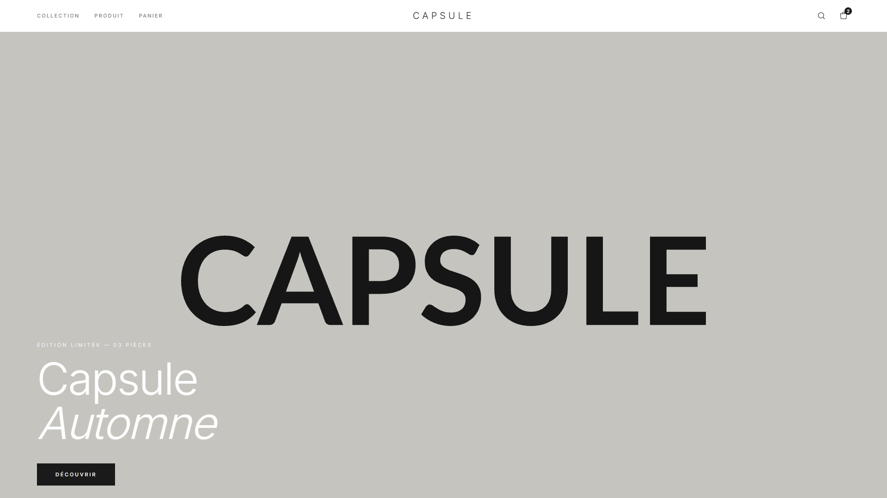

# CAPSULE — boutique e-commerce (maquette)

Maquette front-end d'une boutique de mode pour une collection capsule.
Design minimaliste premium, **mobile-first**, six pages complètes.



## Pages

| Page | Fichier | Contenu |
|---|---|---|
| Accueil | `index.html` | Hero plein écran, grille produits |
| Collection | `collection.html` | Filtres catégorie / taille / couleur / prix, tri, drawer mobile |
| Produit | `produit.html` | Galerie, sélecteur de taille, accordéons |
| Panier | `panier.html` | Quantités, recalcul du total, état vide |
| Commande | `checkout.html` | Formulaire de commande (maquette non fonctionnelle) |
| Confirmation | `confirmation.html` | Récapitulatif, suivi de livraison |

## Stack

- HTML statique, aucune étape de build
- Tailwind CSS via CDN
- JavaScript natif, zéro dépendance
- Navbar, panier et pied de page partagés depuis `assets/app.js`

## Fonctionnalités

- Navbar sticky avec drawer panier et menu mobile
- Filtres combinables avec puces actives, tri par prix, état vide
- Sélecteur de taille avec validation et tailles épuisées
- Panier avec quantités et recalcul (livraison offerte dès 200 €)
- Accessibilité : labels, `aria-label`, navigation clavier, fermeture par `Échap`

## Lancer en local

```bash
python -m http.server 8765
```

Puis ouvrir <http://localhost:8765>.

## Avertissement

Projet de **démonstration**. Marque, produits, prix et commandes sont fictifs.
La page de commande ne traite aucun paiement : les champs de carte sont désactivés
et aucune donnée n'est transmise ni stockée.

Images : placeholders générés par [placehold.co](https://placehold.co).
