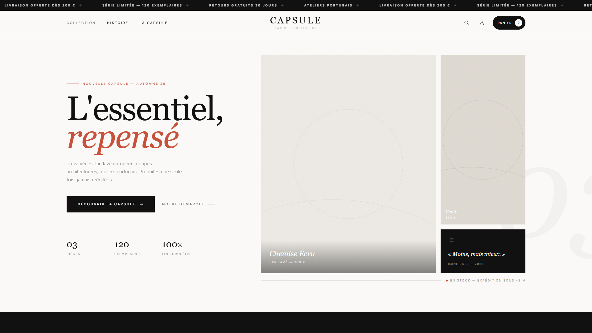

# CAPSULE — boutique e-commerce (maquette)

Maquette front-end d'une boutique de mode pour une collection capsule.
Style **éditorial moderne**, mobile-first, six pages complètes, sans étape de build.



## Pages

| Page | Fichier | Contenu |
|---|---|---|
| Accueil | `index.html` | Barre d'annonce défilante, hero asymétrique, storytelling, capsule avec ajout rapide |
| Collection | `collection.html` | Filtres catégorie / taille / couleur / prix, tri, drawer mobile |
| Produit | `produit.html` | Galerie, sélecteur de taille, accordéons |
| Panier | `panier.html` | Quantités, recalcul du total, état vide |
| Commande | `checkout.html` | Tunnel de commande (maquette non fonctionnelle) |
| Confirmation | `confirmation.html` | Récapitulatif, suivi de livraison |
| Version minimaliste | `index-minimal.html` | Première direction artistique, conservée pour comparaison |

## Direction artistique

- **Typographie** — Playfair Display pour les titres, Inter pour le texte et l'interface
- **Palette** — ivoire `#FAF9F7`, encre `#111111`, accent terracotta `#C7513A`
- **Layout** — grille 12 colonnes volontairement asymétrique, lecture en Z
- **Micro-interactions** — zoom lent sur les visuels, panneau d'ajout rapide au survol, toast de confirmation

## Architecture

```
index.html, collection.html, produit.html, panier.html, checkout.html, confirmation.html
assets/
  app.js      navbar, menu mobile, pied de page, toast — source unique pour toutes les pages
  theme.js    thème Tailwind (polices, couleurs)
  site.css    variables de base, animations
  img/        placeholders SVG générés
```

La navbar et le pied de page sont injectés depuis `assets/app.js`. Modifier le menu à
un seul endroit le met à jour sur toutes les pages.

## Stack

HTML statique, Tailwind CSS via CDN, JavaScript natif. Zéro dépendance, zéro build.

## Lancer en local

```bash
python -m http.server 8765
```

Puis ouvrir <http://localhost:8765>.

## Avertissement

Projet de **démonstration**. Marque, produits, prix et commandes sont fictifs.
La page de commande ne traite aucun paiement : les champs de carte sont désactivés
et aucune donnée n'est transmise ni stockée.
